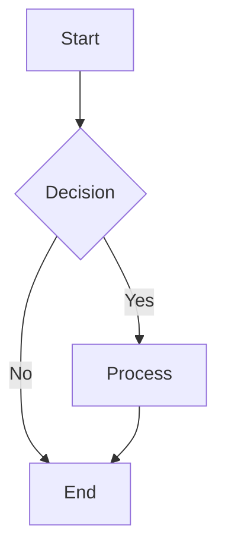
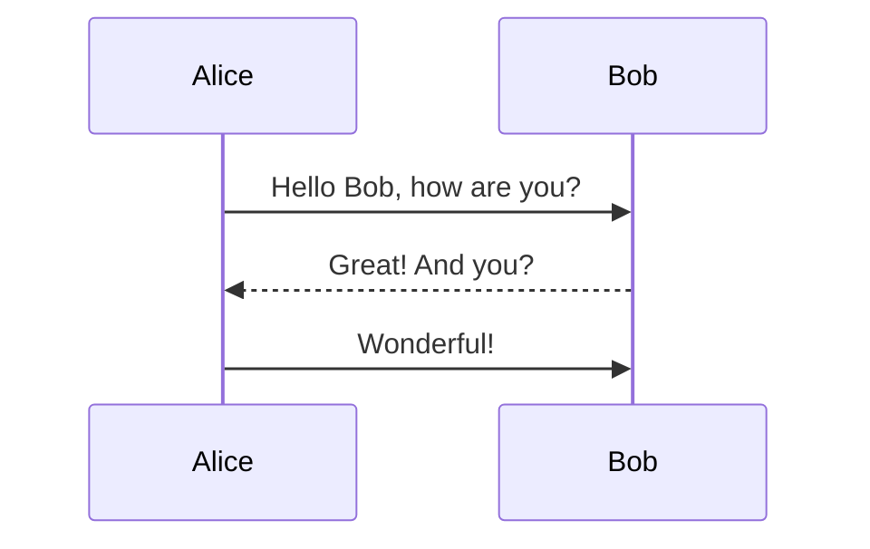
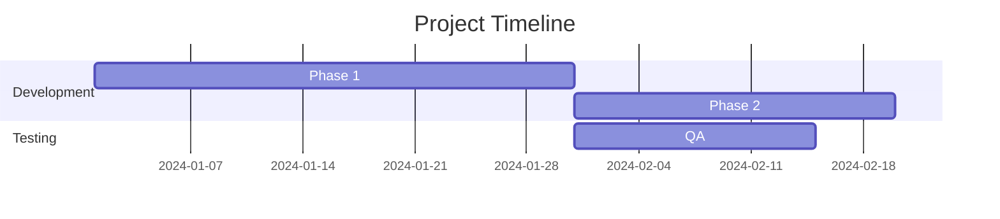
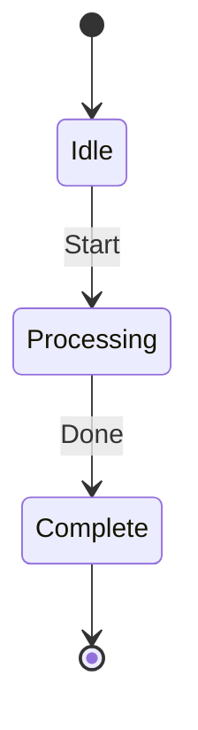
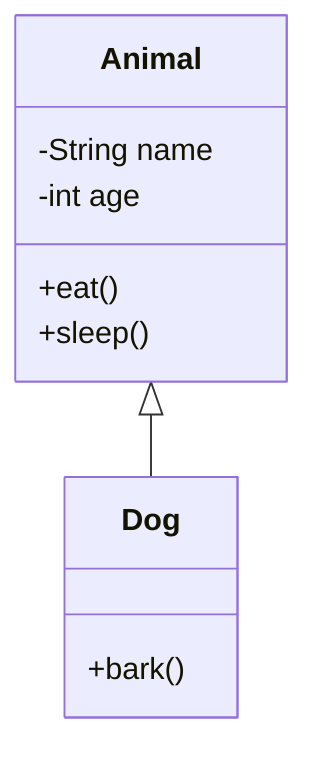
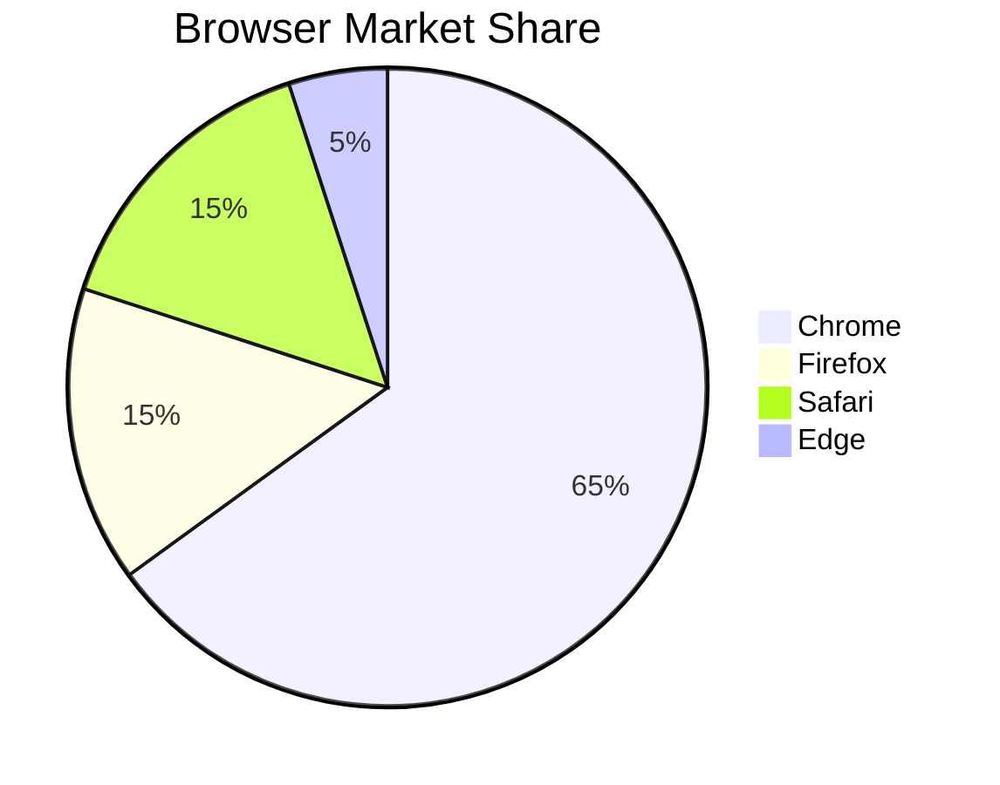
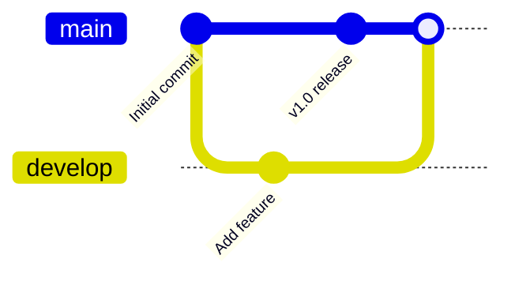
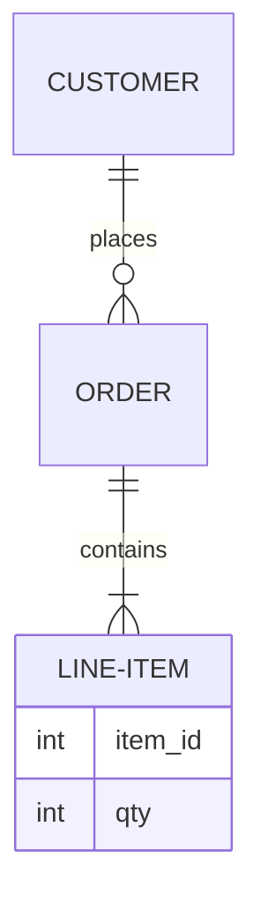

# Mermaid Diagram Templates for Live Preview

## Flowchart

## Sequence Diagram

## Gantt Chart

## State Diagram

## Class Diagram

## Pie Chart

## Git Graph

## Entity Relationship Diagram

